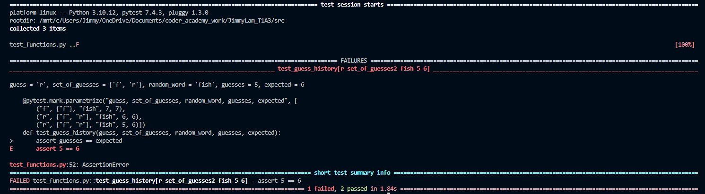

# Terminal Application

## Link to my Github Repo

[My Github Repo](https://github.com/JimmyLam9758/JimmyLam_T1A3)

## Link to my recording

[My Recording](http://youtube.com)

## Overview

This is my terminal application, I have made a word guessing game, similar to hangman or wordle. The code mainly follows the PEP8 Coding style guide. I have only used 4 spaces per indentation level, all my imports are on separate lines and are put at the top of each file and after modules. All my variables are named in lower case and seperated by underscores. Makes some use of white spaces. Most if not all my variables and functions have comments. Some of the features that will be included within my application are, a random word generator which generates a random word from a pool of words that have been categorised. Another feature is an input which outputs the users name within the greeting and farewell. One more feature is the hint feature, at the start of the game it displays how many letters in the random word and after a certain amount of incorrect guesses a hint describing the word's category will be revealed.

[PEP8 Styling Guide](https://peps.python.org/pep-0008/)
[Colored Python Package](https://pypi.org/project/colored/)

## Implentation Plan

## Tests

I ran tests to test out two features of my game. The first feature I tested was the random word generator, I made sure it would generate a word as a string, and then take the length of the word and generate that value as in integer to use across the game. More details of tests in "test_functions.py" file  

Tests for my word generator, first test passes and 2nd and 3rd test purposely failed.

These are the test for my guess history, first and 2nd test should pass and 3rd test should purposely fail.

## Project Management

## Instructions on how to run program
