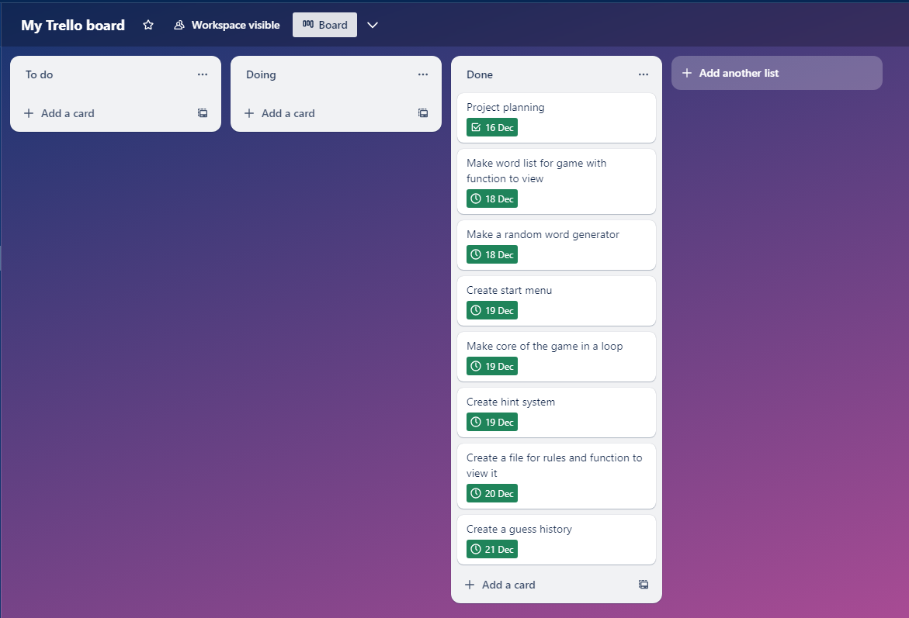

# Terminal Application

## Link to my Github Repo

[My Github Repo](https://github.com/JimmyLam9758/JimmyLam_T1A3)

## Link to my recording

[My Recording](http://youtube.com)

## Overview

This is my terminal application, I have made a word guessing game, similar to hangman or wordle. The code mainly follows the PEP8 Coding style guide. I have only used 4 spaces per indentation level, all my imports are on separate lines and are put at the top of each file and after modules. All my variables are named in lower case and seperated by underscores. Makes some use of white spaces. Most if not all my variables and functions have comments. Some of the features that will be included within my application are, a random word generator which generates a random word from a pool of words that have been categorised. Another feature is an input which outputs the users name within the greeting and farewell. One more feature is the hint feature, at the start of the game it displays how many letters in the random word and after a certain amount of incorrect guesses a hint describing the word's category will be revealed.

[PEP8 Styling Guide](https://peps.python.org/pep-0008/)
[Colored Python Package](https://pypi.org/project/colored/)

## Implentation Plan

### Project Management

1. Word list and random word generator, used to generate a new random word each time a user plays the game.
    - Create categories for words (I chose the categories of animals, foods, sports and countries)
    - Create words for those categories that vary in length and difficulty
    - Combine categories into one big list
    - Create a function using random module to pick word from list
    - Add a way to measure length of random word to function.
2. Starting menu, takes user input and outputs greeting and a menu that navigates you through app depending on user input.
    - Create function for menu
    - Add selections for user to choose from
    - Create an input for user's name
    - Add greeting for user
    - Create error handling.
3. Guess history system, to disallow duplicate guesses and properly lower total guess count.
    - Create function for guess history
    - If user inputs "exit" quit game
    - Implement empty set (because it doesn't allow duplicates) that takes user's guesses and stores them.
    - Implement only lower guess count if word is not in the random word given and has not been guessed before
    - Only allow 7 incorrect guesses before game over
    - Add an output message for user.
4. Hint system, to help user guess the word
    - When user has 4 guesses remaining print the category of the word as hint
    - Prints different hint depending on random word
    - Only 1 hint can be given
5. View words list and rules
    - Create function to view and print different files
    - Opens dedicated file and reads it
    - Print off file for user.

My Trello Project Management

## Tests

I ran tests to test out two features of my game. The first feature I tested was the random word generator, I made sure it would generate a word as a string, and then take the length of the word and generate that value as in integer to use across the game. I also test the word guess history function checking if it would correctly print the correct letter and not allow duplicates and correctly lower guess count. More details of tests in "test_functions.py" file  

Tests for my word generator, first test passes and 2nd and 3rd test purposely failed.

These are the test for my guess history, first and 2nd test should pass and 3rd test should purposely fail.

## Instructions on how to run program

No hardware or system requirements needed. Application should run on any terminal or system with Python 3 installed, If python not installed running the appropriate bash script within files will install python.

1. Open files in terminal and change directory to the src file.
2. To check if python is intalled, run python bash script using the command "./python.sh"
3. Then run the bash script "./run.sh" to create a virtual environment for the application and download necessary external python packages needed.
4. Game will begin by asking user to input name.
5. A greeting will appear and a start menu, typing "1" will begin game, typing "2" will print list of words, typing "3" will show you How to play and typing 4 will close app.
6. Once the game has begun, a random word will be generated and you may begin guessing.
6.5. Typing "exit" during the game will quit and close the game.
7. Input single letters to try to guess word, players have 7 incorrect guesses before game is over.
